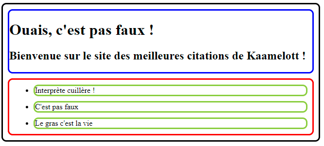
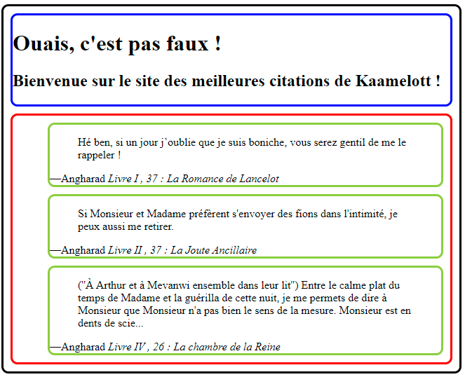
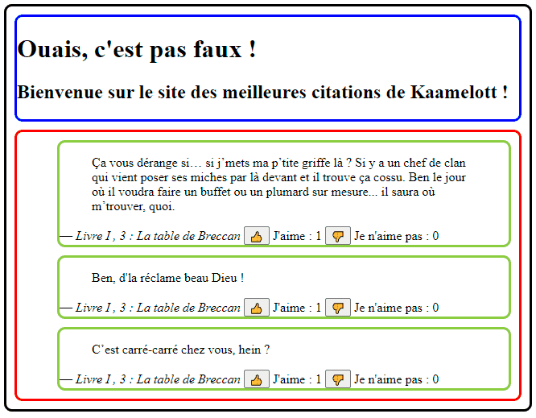

# Dojos React

## Dojo #1 : Le tableau des citations de Kaamelott

On vous demande de réaliser en React, la liste des meilleures citations de Kaamelott.

### Etape 1 : Affichage des citations

Objectif : arriver à découper votre application React en 4 composants :

- `App` (noir)
- `Header` (bleu)
- `QuoteList` (rouge)
- `Quote` (vert)

Et y intégrer des données basiques.

### Etape 2 : Affichage détaillé de chaque citation

Objectif : utiliser les props pour passer toutes les données nécessaires à votre composant `Quote` et avoir le détail sur chaque citation :

- De la citation
- De l'auteur
- De la saison
- De l'épisode

Pour ce faire, vous pouvez vous baser sur l'api suivante : [API citations Kaamelott](https://github.com/sin0light/api-kaamelott). Elle vous permettra d'avoir des données déjà utilisables.

> ⚠ **Attention**, l'objectif n'est pas de consommer directement l'API, mais seulement de la tester dans votre navigateur pour récupérer des données. La récupération de données dans une application React sera vue ultérieurement.

### Etape 3 : Gestion des likes

Objectif : utiliser le `state` et les `event handlers` pour gérer les événements sur les clics et mettre à jours les données.

Pour ce faire, vous aurez certainement besoin de gérer les citations avec des ID. Regardez du côté de [la gestion de la modification des données à l'interieur de tableaux](https://beta.reactjs.org/learn/updating-arrays-in-state) pour gérer correctement l'opération.

### Etape 4 : Bonus CSS

Objectif : rendre le tout un peu attrayant, parce que c'est un peu moche quand même. Vous êtes autorisés à ajouter un peu de CSS.

## Dojo #2 : La no-TODO list

Pour changer un peu de la classique TODO list, on vous demande de réaliser une liste de chose à ne pas faire.

### Etape 1 : Afficher la no-TODO list

Objectif : maquetter à la volée la mini no-TODO list.

Vous choisirez la façon dont vous voulez afficher votre no-TODO list.

> ℹ Cette étape peut se faire tous ensemble, pas besoin de lancer le chrono en mode Dojo !

### Etape 2 : Découper chaque item en composant

Objectif : Arriver à découper son application React en plusieurs composants.

Un découpage possible pourrait être :

- `App`
- `Header`
- `ItemForm`
- `ItemList`
- `Item`

### Etape 3 : Gérer l'ajout d'élément à la liste

Objectif : Gérer l'ajout d'un élément à la liste via la soumission du formulaire de nouvel élément.

### Etape 4 : Gérer la validation d'une non réalisation

Objectif : A l'aide d'une case à cocher, gérer la non réalisation d'un item de la liste. Vous pouvez changer le style de l'item (couleur en gris, style italique et barré).
